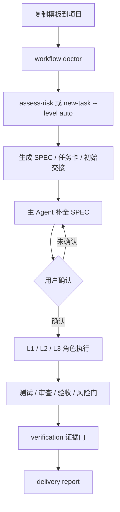

# Agent Workflow Template

一个可作为 Codex / Claude Code 插件安装，也可复制到任意开发项目的多子 Agent 工程工作流模板。

它把 AI 代码协作拆成主 Agent、测试工程师、开发工程师、验收工程师、质量工程师、安全工程师、性能工程师、文档工程师、集成工程师、部署工程师和风险审查官等角色，并通过 L1 / L2 / L3 分级控制实际启用范围。

## 定位

本项目刻意保持轻量：

- 比单个 `AGENTS.md` 更完整：包含角色、hook、状态、任务卡、验证和交付模板。
- 比单一 Skill 更完整：提供 `.codex-plugin/`、`.claude-plugin/` 和共享 `skills/`。
- 比重型多 Agent 平台更轻：没有后台服务、dashboard、MCP 编排器或知识图谱。
- 适合真实项目：强调 SPEC 边界、风险分级、TDD、证据门和交付记录。

## 工作流一览



## 和其他方案的区别

| 方案 | 优点 | 代价 | 本项目的选择 |
|------|------|------|--------------|
| 单文件 `AGENTS.md` | 接入最快 | 缺少任务状态、角色产物和证据记录 | 保留 `AGENTS.md`，再补工作流目录和 CLI |
| 大型多 Agent 平台 | 自动化强，功能多 | 安装重、学习成本高、容易过度工程化 | 不做后台、dashboard、MCP 编排器 |
| SDD / 规格驱动流程 | SPEC 纪律强 | 可能弱化工程角色和交付证据 | SPEC 边界 + 工程角色 + 证据门 |
| 本模板 | 轻量、可复制、可检查 | 不负责自动长期调度 | 让主 Agent 按状态和质量门推进 |

适合使用本模板的项目：真实产品、长期维护代码库、AI 参与开发但需要测试和审查证据的工程项目。

不适合使用本模板的场景：一次性脚本、纯实验 demo、需要完整自动化编排平台的团队。

## 快速使用

复制以下内容到目标项目根目录：

```text
AGENTS.md
Agent.md
.agent-workflow/
scripts/
tests/
PROJECT_PROFILE.md
QUICKSTART.md
INSTALL_SUPERPOWERS.md
```

检查接入状态：

```bash
python3 scripts/workflow.py doctor
```

评估任务风险等级：

```bash
python3 scripts/workflow.py assess-risk "Add payment checkout with API keys"
```

初始化一个新任务：

```bash
python3 scripts/workflow.py new-task "Add user login" \
  --level L2 \
  --reason "Touches authentication and user sessions."
```

也可以让 CLI 自动建议等级：

```bash
python3 scripts/workflow.py new-task "Add payment checkout" \
  --level auto \
  --summary "Add payment checkout with API keys and production deployment."
```

然后让主 Agent 读取 `AGENTS.md`、`PROJECT_PROFILE.md` 和 `.agent-workflow/state.md`，从 `intake_hook` 开始推进。

## 核心文件

- `Agent.md` / `AGENTS.md`：项目级 Agent 入口规则。
- `.codex-plugin/plugin.json`：Codex 插件入口。
- `.claude-plugin/plugin.json`：Claude Code 插件入口。
- `skills/agent-workflow/SKILL.md`：跨 Agent 的工作流 Skill。
- `.agent-workflow/WORKFLOW.md`：完整工作流。
- `.agent-workflow/SKILLS.md`：Skill 加载约定。
- `.agent-workflow/STATE_RULES.md`：状态推进规则。
- `.agent-workflow/agents/`：各子 Agent 职责文档。
- `.agent-workflow/templates/`：SPEC、任务卡、交接、审查、验证和交付模板。
- `scripts/workflow.py`：本地 CLI，包含 `doctor` 和 `new-task`。
- `PROJECT_PROFILE.md`：目标项目技术栈、命令、环境变量和约束。

## 插件形态

本仓库采用和 Superpowers 类似的包形态：平台入口文件负责让 Agent 工具发现插件，实际工作流能力放在共享 `skills/` 目录。

```text
.codex-plugin/plugin.json
.claude-plugin/plugin.json
skills/agent-workflow/SKILL.md
skills/agent-workflow/agents/openai.yaml
```

Codex 读取 `.codex-plugin/plugin.json` 并从 `skills/` 发现 Skill。Claude Code 读取 `.claude-plugin/plugin.json`，并使用同一套仓库内容作为插件能力来源。

入口 Skill 的职责是：

- 安装或检查 `AGENTS.md`、`PROJECT_PROFILE.md`、`.agent-workflow/` 和 `scripts/workflow.py`。
- 引导 Agent 从 `superpowers_bootstrap_hook` 和 `intake_hook` 开始。
- 要求在用户确认 SPEC 和任务清单前不进入实现。
- 要求完成前记录验证证据和交付报告。

## 给 Agent 的安装提示

在目标项目根目录打开 coding agent，直接粘贴：

```text
请把 https://github.com/peyoba/agent-workflow-template 安装到当前项目。

要求：
1. 复制 AGENTS.md、Agent.md、PROJECT_PROFILE.md、QUICKSTART.md、INSTALL_SUPERPOWERS.md、.agent-workflow/、scripts/、tests/ 和 skills/。
2. 如果目标项目也要作为插件发布，同时复制 .codex-plugin/ 和 .claude-plugin/。
3. 如果目标项目已经有 AGENTS.md、Agent.md、skills/ 或 .agent-workflow/，不要覆盖，先展示差异并等待确认。
4. 安装后运行 python3 scripts/workflow.py doctor。
5. 如果 PROJECT_PROFILE.md 仍有占位符，先根据项目文件补全；无法确认的再问我。
```

## 任务等级

- `L1`：小改动，启用开发工程师和验收工程师。
- `L2`：常规功能，启用测试、开发、验收和质量工程师。
- `L3`：高风险任务，在 L2 基础上加入安全、风险、性能、文档、集成和部署角色。

风险分级是质量门选择，不是团队人数。大多数任务应落在 L1 或 L2；只有涉及安全、支付、密钥、数据库、外部 API、部署或生产风险时才进入 L3。

## 验证

```bash
python3 -m pytest tests/test_workflow_cli.py -v
python3 scripts/workflow.py doctor
```

## License

MIT
